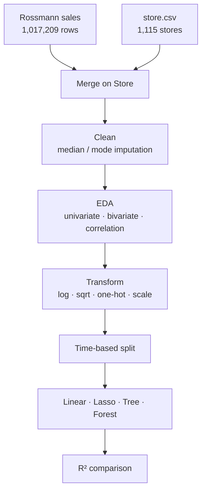

# 📈 Rossmann Sales Forecasting

**Predicting daily sales for 1,115 drug stores — where tree models beat linear ones by a wide margin, and tuning mattered more than model choice.**

[](https://python.org)
[](https://scikit-learn.org)
[](https://pandas.pydata.org)
[](LICENSE)

[**📺 Project walkthrough (video)**](https://youtu.be/iNL6wr-eEA0) · [**📊 Dataset (Kaggle)**](https://www.kaggle.com/competitions/rossmann-store-sales/data) · [**📓 Open in Colab**](https://colab.research.google.com/github/MohanVishe/rossmann-sales-forecasting/blob/main/notebooks/individual-project.ipynb)

---

## The problem

Rossmann operates over 3,000 drug stores across seven European countries. Store managers forecast daily sales up to six weeks ahead, and those forecasts drive staffing and stock. Done by hand across hundreds of stores, the results vary wildly with whoever is doing the forecasting.

The task: predict daily sales per store from 1,017,209 historical records, given promotions, competition, school and state holidays, seasonality and store type.

## Results

R² on a **time-based** train/test split — the later period held out, so the model is never evaluated on data from before what it trained on.

| Model | Train R² | Test R² | Read |
|---|---:|---:|---|
| Linear Regression | — | **0.836** | The linear baseline. Explains most of the variance, misses the rest. |
| Lasso (α = 0.0001) | 0.850 | **0.836** | Regularisation changed essentially nothing — the linear model wasn't overfitting, it was *underfitting*. |
| Decision Tree (default) | 1.000 | **0.946** | Big jump, and a train R² of exactly 1.0 — memorised the training set completely. |
| Decision Tree (tuned) | 0.979 | **0.951** | `min_samples_leaf=8`, `min_samples_split=5`. Constraining the tree **lowered** train score and **raised** test score. |
| **Random Forest (n=80)** | 0.997 | **0.965** | 🏆 Best. Averaging across trees recovers the gain without the single tree's brittleness. |

### What the numbers say

**1. The gap between linear and tree models is the whole story.** 0.836 → 0.965 is not a tuning win, it's a statement that the relationships here are not linear. Sales respond to promotions, day of week and holidays in ways that interact — a promotion on a Monday is not a promotion on a Sunday — and a linear model cannot express that no matter how it is regularised.

**2. Lasso confirmed it.** If the linear model had been overfitting, regularisation would have helped. Test R² moved by 0.00005. That is a clean diagnosis: the problem was model capacity, not variance.

**3. The default Decision Tree scored 1.000 on train.** Perfect training accuracy is a warning, not an achievement — the tree grew until every leaf was pure. Tuning it *down* (`min_samples_leaf=8`) cost 0.021 of train score and bought 0.006 of test score. Small in absolute terms, but it's the right direction and it's the lesson: the unconstrained model looked better and generalised worse.

**4. Random Forest wins, and still shows a 0.032 train–test gap.** More trees and depth limits would likely close some of it.

---

## Approach



### Decisions that shaped the result

| Decision | What I did | Why |
|---|---|---|
| **Closed stores** | Dropped rows where the store was shut | 17% of rows had sales of exactly 0 because the store wasn't open. Training on them teaches the model to predict closure, not demand — a different problem, and it drags the distribution badly. |
| **Missing `CompetitionDistance`** | Median, not mean | Under 1% missing, but the distribution is strongly right-skewed. The median is resistant to that; the mean would have been pulled up by a handful of very distant competitors. |
| **Missing categoricals** | Mode | `Promo2SinceWeek` and friends are only missing where the store never joined Promo2. |
| **Skewed features** | Log on `CompetitionDistance`, square root on `Customers` | Both were heavily right-skewed. Transformation pulls them toward normal, which matters for the linear models and reduces outlier leverage for all of them. |
| **Train/test split** | **Time-based, not random** | A random split lets the model see the future and predict the past. For a forecasting problem that inflates every score and the model fails the moment it's deployed. |
| **One-hot encoding** | Fitted on train only | Fitting the encoder on the full dataset leaks test-set category information into training. |

### What the EDA found

- **December is the peak month** — a strong, clean seasonal effect
- **Promotions lift sales**, and 38.2% of records had one running
- **Customers and sales correlate strongly** (as they must) — the useful part is that `DayOfWeek` correlates *negatively* with both
- **Sundays are closed**, which pushes Monday slightly up
- **Store type B outsells every other type**
- **Closer competition coincides with higher sales** — counterintuitive until you read it as a location signal: competitors cluster where the footfall already is

### Hypotheses tested

| # | Hypothesis | Held up? |
|---|---|---|
| 1 | Promotions increase sales | ✅ |
| 2 | Weekend sales are lower | ✅ (stores closed Sundays) |
| 3 | Holidays decrease sales | ✅ state holidays; ❌ **school** holidays *increased* sales |
| 4 | Customers correlate positively with sales | ✅ |
| 5 | Sales are zero when stores are closed | ✅ — and that's why those rows were dropped |

---

## What I'd do differently

Written with some distance from the original work.

1. **RMSPE, not R².** The Kaggle competition scores on root mean square percentage error, which weights a ₹50 miss on a ₹500 day far more heavily than on a ₹5,000 day. R² is the wrong lens for a business forecasting problem where relative error is what hurts.
2. **Gradient boosting.** XGBoost and LightGBM are the standard answer for tabular problems this shape and would almost certainly beat 0.965.
3. **Proper time-series cross-validation** — expanding-window folds rather than one split. A single held-out period can be lucky.
4. **Richer date features.** Days until/since a holiday, days into a promotion, week of year. The current features treat each day too independently for a problem this seasonal.
5. **Per-store modelling.** 1,115 stores are pooled into one model. Store-level or clustered models would capture local behaviour the pooled model averages away.
6. **Feature importance.** The forest computes it for free and it was never extracted — which means the model's own view of what drives sales went unread.

---

## Layout

```
├── notebooks/
│   ├── individual-project.ipynb   # the full analysis — start here
│   └── team-project.ipynb         # group version of the same problem
├── docs/
│   ├── technical-documentation.docx
│   ├── summary.docx
│   └── presentation.pptx
└── README.md
```

**On authorship:** `individual-project.ipynb` is my own work end to end — the results table above comes from it. `team-project.ipynb` is the group submission for the same problem and is included for completeness.

## Data

Not committed. Download `train.csv` and `store.csv` from the [Kaggle competition page](https://www.kaggle.com/competitions/rossmann-store-sales/data) and place them alongside the notebook.

## License

MIT — see [LICENSE](LICENSE).
