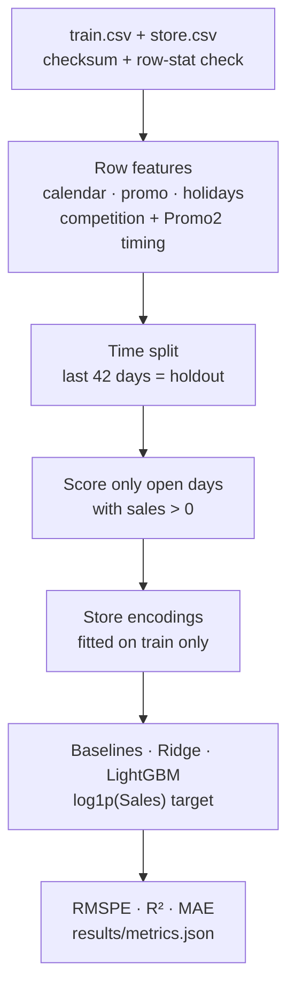

# Rossmann Sales Forecasting

**A six-week-ahead daily sales forecast for 1,115 Rossmann stores, using only inputs known at forecast time and scored on RMSPE (the competition metric) against naive baselines.**

[](https://github.com/MohanVishe/rossmann-sales-forecasting/actions/workflows/tests.yml)
[](LICENSE)

[Dataset (Kaggle competition)](https://www.kaggle.com/competitions/rossmann-store-sales/data) · [2023 project walkthrough (video)](https://youtu.be/iNL6wr-eEA0)

---

## The problem

Rossmann's store managers forecast daily sales up to six weeks ahead, and those forecasts drive
staffing and stock. The task is to predict daily sales per store from 1,017,209 historical rows
(2013-01-01 to 2015-07-31), given promotions, competition, school and state holidays, the
calendar and store type.

## Results

Holdout: the **last six weeks** (2015-06-20 to 2015-07-31), 40,282 open store-days. Models train
on 2013-01-01 to 2015-06-19. Every number below is written by `scripts/run_pipeline.py` to
[`results/metrics.json`](results/metrics.json).

| Model | RMSPE ↓ | R² | MAE (€) |
|---|---:|---:|---:|
| Naive: store × weekday median | 0.2451 | 0.6916 | 1,258.8 |
| Naive: same store, same weekday, 364 days earlier | 0.1718 | 0.8306 | 839.5 |
| Naive: store × weekday × promo median | 0.1449 | 0.8585 | 765.6 |
| Ridge, store fixed effects + train-fitted store encodings | 0.1567 | 0.8551 | 798.9 |
| **LightGBM** | **0.1235** | **0.9195** | **589.3** |

**What the numbers say**

1. **LightGBM is the only model that beats the strongest naive baseline.** RMSPE is 0.1235 against
   0.1449 for the store × weekday × promo median, a 14.8% relative reduction.
2. **A good baseline is hard to beat.** The store × weekday × promo median beats the linear model.
   Most of the signal is "which store, which weekday, promo or not", and a lookup table captures
   that directly. Ridge still has to learn how those factors interact.
3. **The tree model's gains come from store-level history.** By gain, 81% of LightGBM's splits
   use the two train-fitted store encodings (store × promo, store × weekday). The rest is calendar,
   promo and holiday timing.

### Project finding: the 2023 scores used a leaked input

The 2023 version of this project (`notebooks/original/`) reported test R² rising from 0.836
(linear) to 0.965 (random forest). Those models took **same-day `Customers`** as an input. Footfall
on the day being forecast isn't known six weeks in advance, and Kaggle's test set omits it, so
those scores measured fit given footfall rather than forecasting skill.

This version removes it and measures the effect directly. The same LightGBM, with the same
features and rounds plus same-day `Customers`, scores:

| LightGBM on the same holdout | RMSPE | R² | MAE (€) |
|---|---:|---:|---:|
| Forecast-time inputs only (the result above) | 0.1235 | 0.9195 | 589.3 |
| Plus same-day `Customers` (leaky, comparison only) | 0.0628 | 0.9735 | 320.6 |

The leaked input roughly halves the error. The pipeline's tests now keep it out (see Tests).

---

## Approach


```mermaid
flowchart TD
    A["train.csv + store.csv<br/>checksum + row-stat check"] --> B["Row features<br/>calendar · promo · holidays<br/>competition + Promo2 timing"]
    B --> C["Time split<br/>last 42 days = holdout"]
    C --> D["Score only open days<br/>with sales > 0"]
    D --> E["Store encodings<br/>fitted on train only"]
    E --> F["Baselines · Ridge · LightGBM<br/>log1p(Sales) target"]
    F --> G["RMSPE · R² · MAE<br/>results/metrics.json"]
```

### Decisions

| Decision | Choice | Why |
|---|---|---|
| **Inputs** | Only what is known at forecast time | Store metadata, the calendar, and the promo and holiday schedule. Kaggle's test file supplies that schedule for the forecast window. `Customers` is never used. |
| **Split** | Last 6 weeks held out | This matches the six-week horizon managers forecast over. Nothing from the holdout is used for fitting or tuning. |
| **Tuning** | Inner validation window (2015-05-09 to 2015-06-19) | Ridge's alpha and LightGBM's boosting rounds (early-stopped, 3,061) are chosen inside the training window. The model is then refitted on all training data. |
| **Scored rows** | `Open == 1` and `Sales > 0` | Closed days have zero sales by definition, and RMSPE is undefined at zero (Kaggle ignores those rows). |
| **Target** | `log1p(Sales)` | Sales are right-skewed. Error on the log scale tracks relative error, which is what RMSPE measures. |
| **Competition timing** | Months since the competitor opened, plus an "active yet" flag | `CompetitionDistance` is a snapshot, so a competitor counts only from its opening month. When the opening date is missing, it is flagged as unknown rather than filled with a mode. |
| **Promo2** | Active only from the store's ISO start week; monthly flag from its own `PromoInterval` | Stores that never joined Promo2 get zeros. No promo calendar is invented for them. |
| **Store identity** | One-hot in Ridge (fixed effects); train-fitted mean log sales per store, store × weekday and store × promo | A store ID is a label, not a quantity. The encodings are fitted on training rows only. |
| **Holiday recency** | Days since the last state and school holiday, per store; days to Christmas | Computed only from dates at or before each row. |

### Tests

`tests/test_features.py` (18 tests, run in CI on Ubuntu and Windows on synthetic data):

- **No future leakage.** For several cut-off dates d, the test scrambles every column of every
  row after d, then checks that the features for dates ≤ d are unchanged. When a future-looking
  feature was injected on purpose (backward-filled holiday recency), all four cases failed.
- **No `Customers`.** It is absent from the feature list and dropped from the frame. Changing it
  changes nothing.
- **Encoders and baselines are blind to the holdout.** Scrambling holdout targets leaves the
  encodings and baseline predictions unchanged.
- **Split, scoring and timing.** Exact six-week split, RMSPE against a hand calculation, Promo2
  ISO-week starts (including the "Sept" spelling), competition opening months, holiday recency.

## Run it

```bash
uv sync                                   # Python 3.12, exact pins in uv.lock
uv run pytest                             # tests, no data needed
uv run python scripts/run_pipeline.py     # needs data/train.csv and data/store.csv (see Data)
```

A full run takes about 4-5 minutes on a laptop CPU. Two consecutive runs gave identical metrics.

## Data

The data is not committed. It comes from the Kaggle competition
[Rossmann Store Sales](https://www.kaggle.com/competitions/rossmann-store-sales/data), and its
use is governed by the [competition rules](https://www.kaggle.com/competitions/rossmann-store-sales/rules),
which you accept when downloading from Kaggle. Place `train.csv` and `store.csv` in `data/`.

Before anything runs, `src/rossmann/data.py` checks the files:

- **SHA-256 checksums**
  - `train.csv`: `f6e4597c…c1f4cc`
  - `store.csv`: `f56bd124…afb344`
- **Shape and date range**: 1,017,209 × 9 and 1,115 × 10 rows; 2013-01-01 to 2015-07-31.
- **Row stats**: 172,817 closed days; 388,080 promo days; 181,721 school-holiday days;
  3 stores with no competition distance; 544 without a Promo2 start. These match what the 2023
  notebook printed from the Kaggle download.

The run in `results/metrics.json` used byte-identical copies of these files. They were fetched
from two independent public Hugging Face uploads (`AiiN-aini/rossmann-store-sales` and
`gabrieldilay/rossmann-forecast`), whose checksums agree with each other and with the stats
above.

## Limitations and next

- **One holdout window.** Next: expanding-window backtests over several six-week windows, to see
  how much the scores move between periods.
- **Store metadata is a single snapshot.** Competition distance and assortment are as of the
  data's release, not as they were on each date.
- **No lagged sales.** A six-week horizon rules out short lags unless forecasts are made
  recursively. Next: lags of at least 42 days and rolling store trends.
- **One pooled model.** Next: check the per-store error distribution, since RMSPE averages over
  stores with very different volumes.

## Layout

```
├── src/rossmann/
│   ├── data.py          # load + checksum/shape/stat validation
│   ├── features.py      # forecast-time features, time split, train-only store encoder
│   └── models.py        # RMSPE, naive baselines, Ridge, LightGBM
├── scripts/run_pipeline.py   # end-to-end run → results/metrics.json
├── tests/                    # leakage and feature tests (synthetic data)
├── results/metrics.json      # the numbers in this README
└── notebooks/original/       # the 2023 notebooks, kept as history (see the note in each)
```

The 2023 slide deck and write-ups (`docs/`) were removed from the current tree because they
report random-split scores as accuracy. They remain in the git history.

## License

Code: MIT, see [LICENSE](LICENSE). Data: Kaggle competition rules (see Data).
